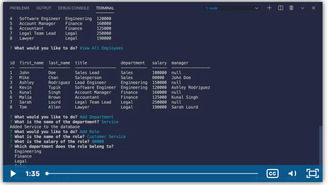

# employee-tracker

Created a connection to a database with a schema and seeds sql files.

Used inquirer to prompt the user to view, add, update, or delete employees, roles, or departments.

Mysql syntax incorperated to join pertinent info into tables for easy read access for user.

Able to cycle through prompts until the user is ready to select quit and end the application.

